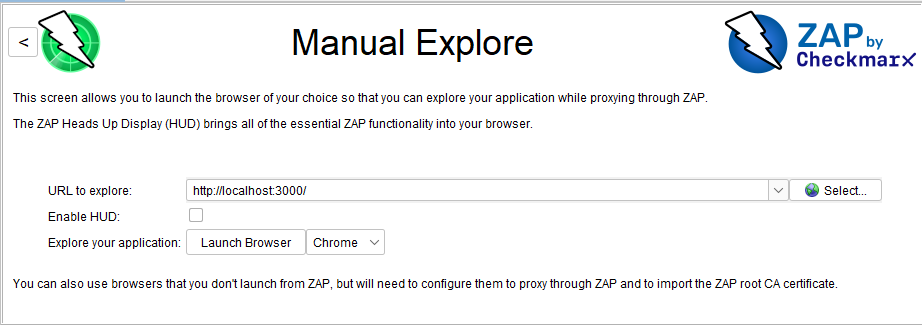
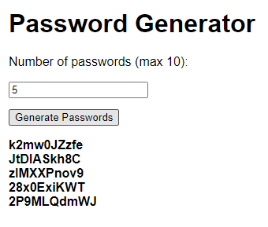
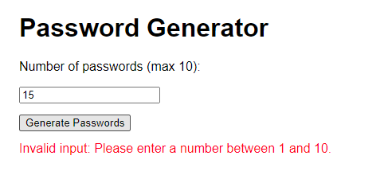
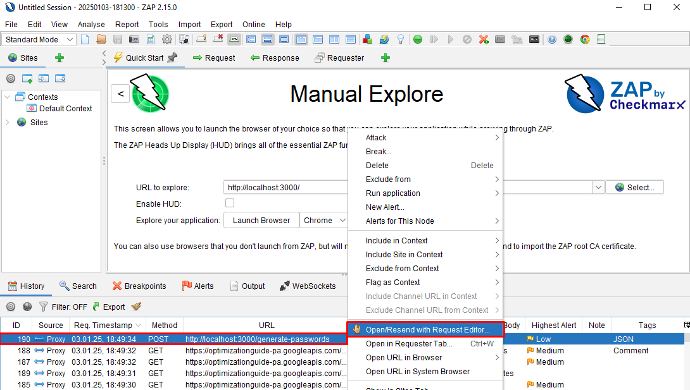
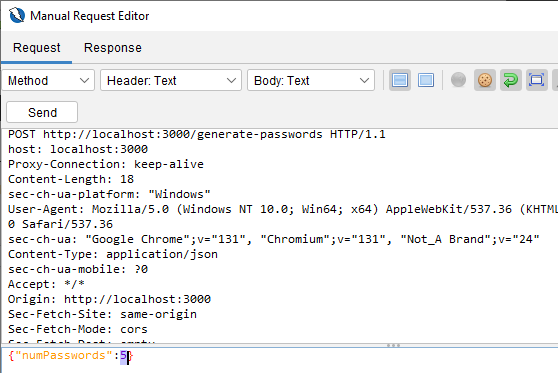
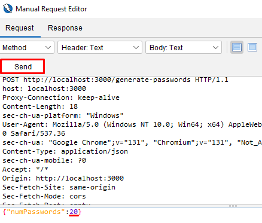
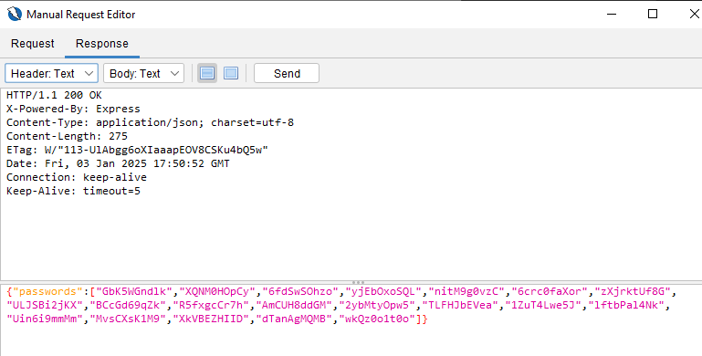
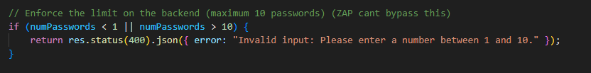

# Password Generator using Node.js

### Test for Intercepting POST Requests from Frontend to Backend using OWASP ZAP Attack Proxy and Node.js Server

The application implements **only client-side** password generation limit of **max 10 passwords** at form completion, with **no server-side validation** to check if the `numPasswords` variable is actually less than 10.

### How to Use

1. **Start the Node.js server**:
    ```bash
    node server.js
    ```

2. **Open ZAP Attack Proxy**:
   - Choose **Manual Explore** in the Quick Start section.
   - Use the Node.js server URL and port **localhost:3000**.
   - Press **Launch Browser**.

   

3. **Enter a valid number of passwords to be generated and press "Generate Passwords"**:

   

4. **Invalid numbers are validated on the client-side only**:

   

5. **Right-click the corresponding request to open it in the Request Editor (intercepting it)**:

   

6. **The Manual Request Editor shows the original request body**:

   

7. **Change the `numPasswords` variable to a number higher than the generation limit (e.g. 20) and press "Send"**:

   

8. **Check the Response**:
   - If the backend accepts the modified request and sends back more than 10 passwords, you’ve successfully bypassed the client-side limit.
   - If the server enforces the limit and rejects the request, you’ll see an error response.
   
   In our case, the app generated **20 passwords**, even though only **10 passwords** are allowed on the client-side. (because no server-side validation is taking place)

   

9. **To fix the vulnerability** a **server-side validation** can be implemented (in **server.js**), which cannot be bypassed directly by tools like OWASP ZAP in the same way that client-side validation can.

   
